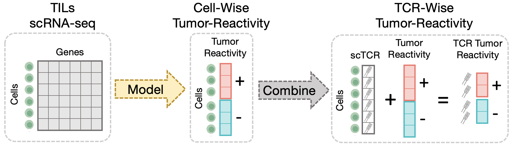

# Framework for Tumor Reactive TCR Prediction

R library for training, evaluating and applying Tumor Reactive TCR predecitors. 

<p align="center">
  
</p>

### Package instalation 

You may install this library directly from this Git repository by running the following code within R or RStudio: 

```
if (!require("devtools", quietly = TRUE))
    install.packages("devtools")

devtools::install_github(repo = "https://github.com/doRemy/Tumor_Reactive_TCR_Prediction", auth_token = <inset your tolken>)
```

Otherwise, you may open a terminal in the directory of the `TRTpred` folder and compile the library by using this command line `$ R CMD build TRTpred`. A file called "TRTpred_0.0.1.tar.gz" should have been created. Finally, you may install the package using this the R command line as follows: `$ R CMD INSTALL TRTpred_0.0.1.tar.gz`


### Dependencies

TODO

### Documentation

See a description of the functions implemented [here](docs/functions.md)

###  Tutorials

A demonstration of TRTpred can be found here https://doremy.github.io/

### Citations

TODO
